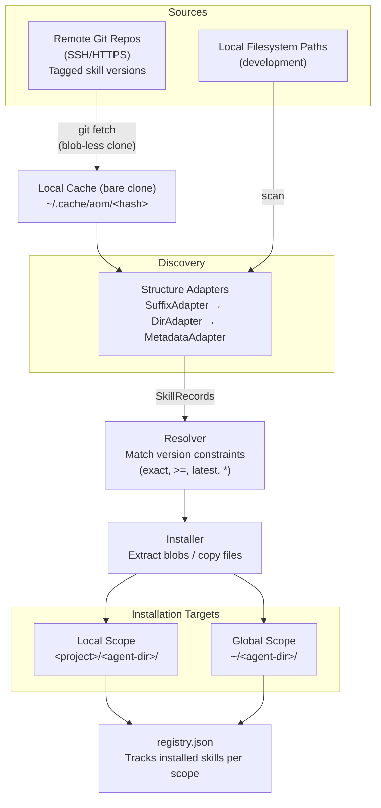

# aom — AI Operation Manager

[](LICENSE)

A zero-dependency Python CLI that installs and manages versioned AI skills (slash commands, agents, hooks) across projects. Skills are versioned by **git tag** in a remote repository; each project independently pins the versions it needs.

**Key highlights:**

- Skills live in a remote git repo — tagged with semantic versions (e.g. `skills/create-jira-story@1.0.0`)
- Projects declare requirements in their AI agent config file (e.g. `CLAUDE.md`)
- Different projects can pin different versions of the same skill simultaneously
- Works with multiple AI agents: Claude Code, Cursor, OpenCode, Codex, Aider

## Branch updates (not yet in `main`)

- Added **Codex support** in runtime configuration (`AGENTS.md` + `.agents/` scope support in code paths).
- Added **multi-agent project selection** and persistence in `.aom/agents.json`.
- Extended install/list/sync/remove flows to operate on all selected agents.
- Added `aom sync agents` mode to sync one selected agent's config/content to other active agents.
- Improved `aom undeploy --purge` to handle read-only files more reliably on Windows.
- Added tests covering selected-agent persistence and multi-agent sync flows.

---

# For Users

## Getting Started

### Requirements

- Python 3.10+ (no third-party packages needed)
- `git` on PATH
- SSH key configured for the remote repository (when using SSH URLs)

### Installation

#### Option A — Pre-built binary with `aom deploy` (recommended)

Download the latest binary for your platform from the [Releases](../../releases) page:

| Platform         | File                    |
| ---------------- | ----------------------- |
| Linux (x86-64)   | `aom-linux-amd64`       |
| Windows (x86-64) | `aom-windows-amd64.exe` |

Then run `aom deploy` to install it system-wide and add it to your PATH automatically:

```bash
# Linux / macOS
chmod +x aom-linux-amd64
./aom-linux-amd64 deploy
# → Deploys to ~/.local/bin/aom and adds it to PATH
```

```powershell
# Windows
.\aom-windows-amd64.exe deploy
# → Deploys to %LOCALAPPDATA%\ai-operation-manager\bin\aom.exe and adds it to PATH
```

After deploying, open a new terminal and verify with `aom --help`.

#### Option B — Manual placement

If you prefer not to use `aom deploy`, you can manually copy the binary to a directory on your PATH:

```bash
# Linux / macOS
chmod +x aom-linux-amd64
sudo mv aom-linux-amd64 /usr/local/bin/aom
```

```powershell
# Windows — copy to a directory on your PATH, e.g. C:\tools\
Move-Item aom-windows-amd64.exe C:\tools\aom.exe
```

#### Option C — From source

Clone the repository and add `bin/` to your PATH:

```bash
# Unix / macOS / WSL
git clone git@github.com:yourorg/ai-operation-manager.git ~/ai-operation-manager
export PATH="$HOME/ai-operation-manager/bin:$PATH"   # add to ~/.bashrc or ~/.zshrc
```

```powershell
# Windows PowerShell
git clone git@github.com:yourorg/ai-operation-manager.git $HOME\ai-operation-manager
# Add $HOME\ai-operation-manager\bin to your system PATH, then use aom.ps1
```

### Uninstallation

To remove the deployed binary and clean up PATH:

```bash
aom undeploy
```

To fully remove all global data created by aom (repository cache, settings, and globally installed operations):

```bash
aom undeploy --purge
```

The `--purge` flag removes:

| Data                     | Location (Linux/macOS)                        | Location (Windows)                                   |
| ------------------------ | --------------------------------------------- | ---------------------------------------------------- |
| Deployed binary          | `~/.local/bin/aom`                            | `%LOCALAPPDATA%\ai-operation-manager\bin\aom.exe`    |
| Repository cache         | `~/.cache/ai-operation-manager/`              | `%LOCALAPPDATA%\ai-operation-manager\`               |
| Global settings          | `~/.config/aom/`                              | `%APPDATA%\aom\`                                     |
| Globally installed ops   | `~/.claude/skills/`, `commands/`, `agents/`, `hooks/`, `registry.json` | Same directory names under `%USERPROFILE%` |

> **Note:** `aom undeploy --purge` does not remove local project data (e.g. `<project>/.claude/`). Remove those directories manually if needed.

### Quick Start

#### 1. Initialize a project

```bash
cd ~/my-project
aom init
```

The wizard detects your AI agent config file (e.g. `CLAUDE.md`), asks for remote repository URLs and optional local paths, then saves the configuration globally. On first use it clones the remote repos into a local cache.

```
aom init

  Directory: /home/user/my-project

  Found: CLAUDE.md  →  ClaudeCode
  Use this config file? [Y/n]:

  No repositories configured yet.

  Enter the SSH (or HTTPS) URLs of your skill repositories.
    Separate multiple URLs with commas.

    Repository URL(s): git@gitlab.com:myorg/ai-grimoire.git, git@github.com:myorg/more-skills.git

  ✓ Saved 2 repository URL(s) to ~/.config/aom/settings.json

  Optionally, you can add local filesystem paths to skill repositories.
  This is useful for local development or when skills are stored on disk.

    Add local paths? [y/N]: y
    Local path(s): /home/user/my-local-skills

  ✓ Saved 1 local path(s) to ~/.config/aom/settings.json

  ✓ Primary repository URL saved to CLAUDE.md

  Fetch skill index from repositories now? [Y/n]:
  ✓ git@gitlab.com:myorg/ai-grimoire.git — 12 skill version(s)
  ✓ git@github.com:myorg/more-skills.git — 5 skill version(s)
  ✓ Fetched. 17 total skill version(s) available.
  ✓ 3 skill(s) found in local paths

Next steps:
  aom list              — view available skills
  aom view NAME versions — list all versions of a skill
  aom install NAME      — install a skill
  aom sync              — install all required skills from config
```

#### 2. Declare requirements in project AI config file (e.g. CLAUDE.md)

````markdown
## Skills Source

```yaml
url: "git@gitlab.com:myorg/ai-grimoire.git"
```

## Skills Requirements

```yaml
required:
  create-jira-story: "1.0.0"
  design-workflow: ">=1.1.0"
  evaluate-workflow: "latest"
```
````

#### 3. Install everything

```bash
aom sync
```

Any teammate who checks out the project runs the same command — the tool clones the remote on first use automatically.

---

## Configuration

### Config file integration

`aom init` writes two sections to the project config file:

**`## Skills Source`** — the remote repository URL:

````markdown
## Skills Source

```yaml
url: "git@gitlab.com:myorg/ai-grimoire.git"
```
````

**`## Skills Requirements`** — pinned versions:

````markdown
## Skills Requirements

```yaml
required:
  create-jira-story: "1.0.0"
  design-workflow: ">=1.0.0"
  evaluate-workflow: "latest"
  child/generate-handwriting-practice: "*"
```
````

The header is case-insensitive. The parser accepts fenced YAML blocks or 4-space-indented YAML.

### Global settings

All repository URLs and local paths are stored in the global settings file, managed by `aom init`:

| Platform    | Settings file                 |
| ----------- | ----------------------------- |
| Linux/macOS | `~/.config/aom/settings.json` |
| Windows     | `%APPDATA%\aom\settings.json` |

```json
{
  "version": 2,
  "repositories": [
    { "url": "git@gitlab.com:myorg/ai-grimoire.git" },
    { "url": "git@github.com:myorg/more-skills.git" }
  ],
  "local_paths": ["/home/user/my-local-skills"]
}
```

- **repositories** — Remote git repositories (GitHub, GitLab, etc.) containing versioned skills
- **local_paths** — Local filesystem directories with skill repositories (for development or offline use)

No environment variables are needed. During `aom init`, you can select one or many active agents for a project; selection is persisted in `.aom/agents.json`.

### Version constraints

| Syntax          | Meaning                              |
| --------------- | ------------------------------------ |
| `1.0.0`         | Exact version                        |
| `>=1.2.0`       | Minimum version (highest satisfying) |
| `latest` or `*` | Highest stable version               |

---

## Usage

### Commands overview

| Command                      | Description                                              |
| ---------------------------- | -------------------------------------------------------- |
| `aom init`                   | Interactive setup: detect/select one or many agents, save repo URL |
| `aom fetch`                  | Refresh the operation index from all remote repositories |
| `aom install NAME[:VERSION]` | Install operation in local/global scope for selected agent(s) |
| `aom info NAME[:VERSION]`    | Show rich metadata for an operation before installing    |
| `aom list`                   | Show available and installed versions (aggregated for multiple agents) |
| `aom list requirements`      | Show only skills declared as requirements in the project config        |
| `aom outdated`               | Report installed operations where a newer stable version exists        |
| `aom sync`                   | Sync modes: `requirements` (default), `agents`, `clean` |
| `aom update NAME`            | Update a skill to the latest stable version              |
| `aom view NAME versions`     | List all available versions of an operation              |
| `aom remove NAME`            | Remove an installed operation for selected agent(s)      |
| `aom deploy`                 | Install the aom binary system-wide and add to PATH       |
| `aom undeploy [--purge]`     | Remove the binary (and optionally all global data)       |
| `aom env`                    | Show repository and environment configuration            |

### Single-agent vs multi-agent behavior

- `aom` resolves active agents from `.aom/agents.json` (written by `aom init`), then falls back to detected config files (for example `CLAUDE.md`, `AGENTS.md`, `.kiro`).
- With one active agent, `install`, `list`, `sync`, and `remove` execute only for that one agent's directories:
  local scope `<project>/<agent-dir>/` and global scope `~/<agent-dir>/` (when `--global` is used).
- With multiple active agents, `install`, `list`, `sync`, and `remove` run against all selected agents (in their respective local/global directories).
- `aom env` still prints one active agent view (the first selected), while sync/install/remove/list operate across all selected agents.

### `aom init`

Interactive setup wizard. Detects supported AI agent config files in the project directory, lets you select one or multiple active agents, asks for remote repository URLs and optional local paths, saves global settings, and optionally fetches the tag index.

The wizard guides you through:

1. **Agent selection** — finds supported config files and lets you choose one or all
2. **Remote repositories** — one or more git URLs (GitHub, GitLab, etc.)
3. **Local paths** (optional) — filesystem directories with local skill repos
4. **Config update** — writes the primary repo URL to each selected agent config file
5. **Fetch** — downloads the skill tag index from all configured remotes

`aom init` also writes selected agents to `.aom/agents.json`:

```json
{
  "agents": ["Codex", "ClaudeCode"]
}
```

### `aom install`

```bash
aom install create-jira-story          # latest stable, local scope
aom install create-jira-story:1.0.0    # exact version, local scope
aom install design-workflow:>=1.0.0 --global
aom install create-jira-story --no-overwrite  # skip if already installed
aom install create-jira-story --fetch  # refresh tag index first
```

Behavior:

- With one selected agent: installs exactly once into that agent's target scope (`local` by default or `global` with `--global`).
- With multiple selected agents: installs the resolved version for each selected agent and prints scope with agent name, for example `[local:Codex]`, `[local:ClaudeCode]`.
- Resolution still considers repository records plus installed local/global records for selected agents.

### `aom info`

Inspect a skill's metadata before installing it. Reads the definition file from the remote repository (or local path) and displays all frontmatter fields — no installation required.

```bash
aom info create-jira-story            # latest stable version
aom info create-jira-story:1.0.0     # a specific version
aom info create-jira-story --json    # machine-readable JSON output
aom info create-jira-story --fetch   # refresh tag index first
```

Example output:

```
create-jira-story  @1.2.0  [skills]  (git)
────────────────────────────────────────────────────────────
description         Generate a Jira ticket description from a
                    standard template. Fills in Summary, Details,
                    Specifications, and Testing sections.
author              John Doe
version             1.2.0
tags                ai, jira, productivity

Install status
  local   not installed
  global  not installed

  To install: aom install create-jira-story:1.2.0
```

JSON output (with `--json`) includes `name`, `version`, `type`, `source`, `git_tag`, `frontmatter` (all fields as a flat object), and `installed` status for both local and global scopes.

### `aom list`

Single-agent output:

```
SKILL                    LOCAL    GLOBAL   LATEST
-------------------------------------------------
create-jira-story        —        1.0.0    1.2.0
design-workflow          1.0.0    —        1.1.0
evaluate-skill           —        —        1.0.0
```

Multi-agent output behavior:

- `LOCAL`/`GLOBAL` columns are aggregated across selected agents.
- If selected agents have different installed versions, the chosen displayed version gets a `*` suffix (for example `1.2.0*`).
- A footnote is printed: `* not all selected agents have the same installed version`.
- In `--json`, each operation includes `"partial": { "local": bool, "global": bool }`.

**Uninitialized project behavior**: if `aom init` has not been run in the current project (no `.aom/agents.json`), `aom list` shows only globally installed skills and prints a note:

```
Note: Only global skills are visible — aom has not been initialized in this project.
      Run 'aom init' to enable local skill management.
```

The `LOCAL` column is omitted in this mode. If no supported agent config files are detected at all, the note is suppressed.

Use `--fetch` to pull the latest tags from the remote before listing.

#### `aom list requirements`

Shows only skills that are declared as requirements in the project config file(s), together with the pinned constraint and current install status.

```
SKILL                    REQUIREMENT  LOCAL    GLOBAL   LATEST
--------------------------------------------------------------
create-jira-story        1.0.0        1.0.0    —        1.2.0
design-workflow          >=1.1.0      1.1.0    —        1.2.0
evaluate-skill           latest       —        —        1.0.0
```

When multiple agents are active and have **different constraints for the same skill**, an `AGENT` column is added and the skill appears once per agent that declares it:

```
SKILL              AGENT       REQUIREMENT  LOCAL    GLOBAL   LATEST
--------------------------------------------------------------------
create-jira-story  ClaudeCode  1.0.0        1.0.0    —        1.2.0
create-jira-story  Kiro        >=1.1.0      —        —        1.2.0
```

If all agents share the same constraint, the `AGENT` column is omitted and the skill appears once (as with single-agent mode).

### `aom outdated`

Concise report of installed operations where a newer stable version exists in the remote. Distinct from `aom list` (which shows everything) — focused view for upgrade decisions.

```bash
aom outdated              # check all installed operations
aom outdated --type skills  # limit to a specific artifact type
aom outdated --json       # machine-readable JSON output
aom outdated --fetch      # refresh tag index before checking
```

Example output:

```
SKILL                    INSTALLED   LATEST
-------------------------------------------
create-jira-story        1.0.0       1.2.0
design-workflow          1.1.0       1.3.0
```

Pre-release versions (e.g. `1.2.0-SNAPSHOT`) are never shown as the "latest" — only stable releases count. If all installed operations are current, prints `All installed operations are up to date.`

### `aom sync`

```bash
aom sync                      # sync requirements for selected agents (default mode)
aom sync requirements         # explicit default mode
aom sync agents               # copy one selected agent config/content to others
aom sync clean                # requirements sync + remove local extras not in config
aom sync --dry-run            # preview without installing
aom sync --force              # reinstall even if already installed
aom sync --fetch              # fetch latest tags before syncing
aom sync --project-dir /path  # specify project directory
```

Mode details:

- `requirements` (default): reads requirements from each selected agent config and installs missing/outdated operations into each agent's local scope.
- `agents`: interactive copy mode; picks one selected source agent and replicates config + local content + registry to other selected agents.
- `clean`: same as `requirements`, then removes locally installed operations not present in requirements (per selected agent, skipped on agent-level resolution errors).

### `aom remove`

```bash
aom remove create-jira-story          # remove from local scope
aom remove create-jira-story --global # remove from global scope
```

With multiple selected agents, remove is executed for each selected agent in the target scope.

### `aom update`

Reinstalls the latest stable repository version (delegates to `install :latest`).

### `aom view`

Inspect a specific operation. Currently supports the `versions` subcommand, which lists all available versions from all sources (remote repositories, local paths, and installed scopes).

```bash
aom view create-jira-story versions          # list all versions
aom view create-jira-story versions --json   # machine-readable JSON output
aom view create-jira-story versions --fetch  # refresh tag index first
```

Example output:

```
Versions of create-jira-story
--------------------------------------------------
  VERSION               SOURCE           STATUS
  -------               ------           ------
  1.2.0                 repo             stable
  1.1.0                 global, repo     stable  [installed]
  1.0.0                 local, repo      stable  [installed]
  0.9.0-SNAPSHOT        repo             snapshot
```

The `--json` flag outputs a structured JSON object:

```json
{
  "name": "create-jira-story",
  "versions": [
    {
      "version": "1.2.0",
      "type": "skills",
      "stable": true,
      "structure": "git"
    },
    {
      "version": "1.1.0",
      "type": "skills",
      "stable": true,
      "structure": "git"
    },
    { "version": "1.0.0", "type": "skills", "stable": true, "structure": "git" }
  ]
}
```

### `aom deploy`

Copies the running aom executable to a system directory and adds it to the user's PATH. Only available when running from a pre-built binary (not from source).

```bash
aom deploy
```

| Platform    | Deploy location                                       |
| ----------- | ----------------------------------------------------- |
| Linux/macOS | `~/.local/bin/aom`                                    |
| Windows     | `%LOCALAPPDATA%\ai-operation-manager\bin\aom.exe`     |

On Windows, the directory is added to the user PATH via the registry and broadcast to open terminals. On Linux/macOS, an export line is appended to `~/.bashrc` or `~/.profile`.

### `aom undeploy`

Removes the deployed binary and cleans up the PATH entry.

```bash
aom undeploy            # remove binary and PATH entry only
aom undeploy --purge    # also remove all global data (cache, settings, installed operations)
```

Without `--purge`, only the binary and PATH entry are removed. With `--purge`, the following are also deleted:

- **Repository cache** — bare git clones (`~/.cache/ai-operation-manager/` or `%LOCALAPPDATA%\ai-operation-manager\`)
- **Global settings** — `settings.json` (`~/.config/aom/` or `%APPDATA%\aom\`)
- **Globally installed operations** — artifact directories and `registry.json` under each agent's global directory (e.g. `~/.claude/skills/`, `~/.claude/commands/`, etc.)

On Windows, purge now handles read-only files/directories during cleanup.

### `aom env`

```
AI Agent
----------------------------------------
  Agent                          ClaudeCode
  dir_name                       .claude
  config_file                    CLAUDE.md

Global Settings
----------------------------------------
  settings file                  ~/.config/aom/settings.json

Skills Repositories (remote)
----------------------------------------
  [1] git@gitlab.com:myorg/ai-grimoire.git
      cache                      ~/.cache/ai-operation-manager/a3f9b2c1  [✓ cloned]
      tagged versions            12
  [2] git@github.com:myorg/more-skills.git
      cache                      ~/.cache/ai-operation-manager/b7e4c3d2  [✓ cloned]
      tagged versions            5

Skills Repositories (local paths)
----------------------------------------
  [1] /home/user/my-local-skills  [✓ exists]

Install locations
----------------------------------------
  global : /home/user/.claude
  local  : /home/user/my-project/.claude
```

Use `--check` to exit with code 1 if no repositories are configured.

---

## Installation Scopes

| Scope  | Location             | Use case                                |
| ------ | -------------------- | --------------------------------------- |
| Local  | `<project>/<agent-dir>/` | Project-specific, pinned via `aom sync` |
| Global | `~/<agent-dir>/`         | Available in all projects               |

Local takes precedence over global when both are installed.

Examples of `<agent-dir>`: `.claude`, `.agents`, `.kiro`.

| Scope                | Installed version |
| -------------------- | ----------------- |
| Remote repo (source) | `1.2.0` (HEAD)    |
| Global `~/.claude/`  | `1.1.0`           |
| Project A `.claude/` | `1.0.0`           |
| Project B `.claude/` | `1.2.0`           |

---

## Supported AI Agents

The tool detects supported agents from config files in the project directory and can persist selected active agents via `.aom/agents.json` after `aom init`.

| Config file       | Agent      | Status    |
| ----------------- | ---------- | --------- |
| `CLAUDE.md`       | ClaudeCode | Supported |
| `.kiro`           | Kiro       | Supported |
| `.cursorrules`    | Cursor     | Planned   |
| `opencode.json`   | OpenCode   | Planned   |
| `AGENTS.md`       | Codex      | Supported |
| `.aider.conf.yml` | Aider      | Planned   |

If multiple config files are found, the wizard asks which to use.

---

## Common Workflows

### First-time project setup

```bash
cd ~/my-project
aom init
# → detects CLAUDE.md → asks for SSH URL → fetches tag index

aom list                                     # see all available operations
aom view create-jira-story versions          # see all versions of a skill
aom install create-jira-story:1.0.0
aom install design-workflow
```

### Team shares requirements via config file

Any developer clones the project and runs:

```bash
aom sync
# → clones the remote repo (first time), installs required skills
```

### Per-project version pinning

```yaml
# Project A — CLAUDE.md
required:
  create-jira-story: "1.0.0"
  design-workflow: "1.0.0"

# Project B — CLAUDE.md
required:
  create-jira-story: "latest"
  design-workflow: ">=1.1.0"
```

Both projects pull from the same remote repo but install independently.

### System-wide shared skills

```bash
aom install evaluate-workflow:1.0.0 --global
# → available in all projects; local scope takes precedence
```

### Refresh and preview

```bash
aom sync --fetch --dry-run
# → fetches latest tags, shows what would be installed without doing it
```

---

## Troubleshooting

| Problem                          | Solution                                                                 |
| -------------------------------- | ------------------------------------------------------------------------ |
| `git` not found                  | Ensure `git` is installed and on your PATH                               |
| SSH authentication fails         | Verify your SSH key is configured for the remote repository              |
| No skills found after `aom list` | Run `aom list --fetch` to refresh the tag index from the remote          |
| Wrong agent detected             | Run `aom init` again to reconfigure                                      |
| `aom sync` skips a skill         | Check the version constraint in your config file matches an existing tag |

---

# For Developers

## Architecture

### High-level design



### Resolution priority

```
1. Local (<project>/<agent-dir>/)  — already installed in this project
2. Global (~/<agent-dir>/)         — available system-wide
3. Repository (remote git)     — source of truth
```

### Git-backed repository (`git.py`)

`GitRepo` maintains a local bare clone of the remote skills repository:

```
Cache location:
  Linux/macOS: ~/.cache/ai-operation-manager/<url-hash>/
  Windows:     %LOCALAPPDATA%/ai-operation-manager/<url-hash>/
```

Cloned once with `--filter=blob:none` (no file contents downloaded upfront). Blobs are fetched lazily when a skill is installed.

| Method                                 | Network?        | Description                                      |
| -------------------------------------- | --------------- | ------------------------------------------------ |
| `ensure_cloned()`                      | First time only | `git clone --bare --filter=blob:none`            |
| `fetch()`                              | Yes             | `git fetch --prune origin +refs/tags/*:refs/tags/*` |
| `list_skill_tags()`                    | No              | `git for-each-ref refs/tags/` — reads local refs |
| `read_file_at_tag(tag, path)`          | Lazy            | `git show TAG:path` — fetches blob on demand     |
| `extract_path_at_tag(tag, path, dest)` | Lazy            | `git archive` + Python `tarfile` for directories |

### Adapter pattern

Each `StructureAdapter` implements:

```python
can_handle(path) -> bool
extract_records(artifact_dir, artifact_type) -> List[SkillRecord]
```

Adapters are chained in priority order: Suffix → Directory → Metadata. The Metadata adapter is the catch-all for the current repo layout.

| Adapter            | On-disk layout         | Notes                                                              |
| ------------------ | ---------------------- | ------------------------------------------------------------------ |
| `suffix_adapter`   | `name@1.0.0/`          | Version visible in filesystem; requires renaming on release        |
| `dir_adapter`      | `name/1.0.0/`          | Multiple versions can coexist; deeper nesting                      |
| `metadata_adapter` | version in frontmatter | **Recommended** — stable paths, version co-located with definition |

### SkillRecord

```python
@dataclass
class SkillRecord:
    name: str                  # "create-jira-story" or "child/page-painter"
    artifact_type: str         # "skills" | "commands" | "agents" | "hooks"
    path: Optional[Path]       # local path; None for git-only records
    version: Optional[Version]
    structure: str             # "suffix" | "directory" | "metadata" | "flat" | "git"
    git_tag: Optional[str]     # e.g. "skills/create-jira-story@1.0.0"
```

Records from local filesystem scans have `path` set and `git_tag=None`. Records from git tag scanning have `git_tag` set and `path=None`.

### Registry format

Stored inside the agent directory (`registry.json`):

```json
{
  "version": 1,
  "installed": {
    "skills/complex-evaluator": "1.0.2",
    "commands/deploy-skills": "1.0.0"
  },
  "updated_at": "2026-03-27T12:00:00+00:00"
}
```

### AI agent detection

Active agents are resolved via:

1. `.aom/agents.json` selected list (written by `aom init`)
2. Supported config files detected in project dir (`AGENTS.md`, `CLAUDE.md`, `.kiro`, ...)
3. Single-agent fallback selection behavior when needed

**Type directory mapping** — each agent maps artifact types (`skills`, `commands`, `agents`, `hooks`) to its own subdirectories. Example: for Codex local scope is `<project>/.agents/...`, for ClaudeCode `<project>/.claude/...`.

---

## Project Structure

```
.github/
  workflows/
    build.yml               # CI/CD: test, build Linux + Windows, create releases
    bump-version.yml        # Auto-bump version on PR merge (conventional commits)
bin/
  aom                       # Bash / WSL entry point → python -m aom.cli
  aom.ps1                   # PowerShell entry point (handles Python discovery)
  aom-install               # Alias: aom install ...
  aom-list                  # Alias: aom list ...
  aom-sync                  # Alias: aom sync ...
  aom-install.ps1           # Windows aliases
  aom-list.ps1
  aom-sync.ps1
aom/
  __init__.py               # package version
  __main__.py               # python -m aom entry point
  cli.py                    # argparse command dispatcher
  config.py                 # agent detection, path resolution
  settings.py               # global user settings (~/.config/aom/settings.json)
  git.py                    # GitRepo: bare clone + tag-based file access
  models.py                 # Version, SkillRecord, VersionRequirement
  discovery.py              # scan local filesystem or git tags
  resolver.py               # version constraint resolution
  registry.py               # JSON registry (tracks installed versions)
  installer.py              # file copy / git extract + registry update
  manifest.py               # config file parser/writer (requirements + source URL)
  adapters/
    base.py                 # abstract StructureAdapter
    metadata_adapter.py     # recommended: version in frontmatter
    suffix_adapter.py       # option A: name@1.0.0/
    dir_adapter.py          # option B: name/1.0.0/
tests/
  conftest.py               # shared fixtures
  test_models.py            # Version, SkillRecord, VersionRequirement
  test_manifest.py          # CLAUDE.md parsing / writing
  test_registry.py          # JSON registry persistence
  test_resolver.py          # version constraint resolution
  test_discovery.py         # repository scanning, grouping
  test_installer.py         # install / uninstall logic
  test_config.py            # agent detection, path functions
  test_git.py               # GitRepo (mocked subprocess)
  test_cli.py               # argument parsing, command dispatch
  test_settings.py          # global user settings management
  test_adapters.py          # all three structure adapters
main.py                     # PyInstaller entry point (frozen + source modes)
aom.spec                    # PyInstaller build configuration
build.sh                    # Linux / macOS build script
build.ps1                   # Windows build script
Makefile                    # Cross-platform build via GNU make
pyproject.toml              # project metadata + pip entry-point declaration
```

---

## Development Setup

### Prerequisites

- Python 3.10+
- `git` on PATH

### Local setup

```bash
# Clone the repository
git clone git@github.com:yourorg/ai-operation-manager.git
cd ai-operation-manager

# Create a virtual environment and install dev dependencies
python -m venv .venv

# Activate (Linux / macOS)
source .venv/bin/activate

# Activate (Windows PowerShell)
.venv\Scripts\Activate.ps1

# Install the package with dev extras
pip install -e ".[dev]"
```

---

## Testing

The test suite uses **pytest** with coverage reporting.

```bash
# Tests with coverage report
pytest

# Tests without coverage (faster)
pytest --no-cov

# Run a specific test file
pytest tests/test_models.py -v

# Run a single test
pytest tests/test_models.py::TestParseVersion::test_basic_semver
```

Via GNU Make:

```bash
make test       # run pytest
make lint       # flake8 + black --check
make format     # auto-format with black
```

The CI pipeline runs tests across Python 3.10, 3.11, and 3.12 on both Ubuntu and Windows.

---

## CI/CD

### Pipelines

Two workflow files power the CI/CD:

| Workflow         | File                                 | Trigger                                            |
| ---------------- | ------------------------------------ | -------------------------------------------------- |
| **Build**        | `.github/workflows/build.yml`        | Push to `main`, PRs to `main`, version tags (`v*`) |
| **Bump Version** | `.github/workflows/bump-version.yml` | PR merged to `main`                                |

### Build pipeline

On every push to `main` and on every PR targeting `main`, the pipeline runs:

1. **Test** — lint (flake8) + pytest with coverage across Python 3.10/3.11/3.12 on Ubuntu and Windows
2. **Build** — produces platform binaries after tests pass:

| Job             | Runner           | Output         |
| --------------- | ---------------- | -------------- |
| `build-linux`   | `ubuntu-latest`  | `dist/aom`     |
| `build-windows` | `windows-latest` | `dist\aom.exe` |

Each build job:

1. Checks out the repository
2. Sets up Python 3.11 with pip caching
3. Installs PyInstaller
4. Runs the platform build script (`build.sh` / `build.ps1`)
5. Runs a smoke test (`aom --help`)
6. Uploads the binary as a GitHub Actions artifact (retained for 30 days)

### Releasing

Push a version tag to trigger a GitHub Release automatically:

```bash
git tag v1.2.0
git push origin v1.2.0
```

The `release` job downloads both platform artifacts, renames them, generates SHA-256 checksums, and creates a GitHub Release with auto-generated release notes.

Tags containing a hyphen (e.g. `v1.2.0-beta`) are automatically marked as pre-releases.

### Auto version bumping

When a PR is merged to `main`, the `bump-version` workflow automatically creates a new version tag based on the PR title (Conventional Commits):

| PR title pattern                               | Bump type | Example             |
| ---------------------------------------------- | --------- | ------------------- |
| `feat: ...` or `feat(scope): ...`              | Minor     | `v1.0.0` → `v1.1.0` |
| `type!: ...` or `BREAKING CHANGE` in body      | Major     | `v1.0.0` → `v2.0.0` |
| Anything else (`fix:`, `chore:`, `docs:`, ...) | Patch     | `v1.0.0` → `v1.0.1` |

If no version tag exists yet, the first merged PR sets the version to `v1.0.0`.

### Workflow triggers summary

| Event                  | Jobs run                                          |
| ---------------------- | ------------------------------------------------- |
| Push to `main`         | `test`, `build-linux`, `build-windows`            |
| Pull request to `main` | `test`, `build-linux`, `build-windows`            |
| Push tag `v*`          | `test`, `build-linux`, `build-windows`, `release` |
| PR merged to `main`    | `bump-version`                                    |

---

## Build & Release

The project uses [PyInstaller](https://pyinstaller.org) to produce a single self-contained executable.

### Quick build

```bash
# Linux / macOS
bash build.sh

# Windows (PowerShell)
.\build.ps1

# Cross-platform via GNU Make
make build        # build the executable
make clean        # remove dist/, build/ artefacts
make dev-install  # pip install -e . (editable mode)
```

> On Windows, GNU Make is available via `winget install GnuWin32.Make` or `choco install make`.

### Build script options

```bash
# Clean previous artefacts before building
bash build.sh --clean

# PowerShell equivalent
.\build.ps1 -Clean
```

### PyInstaller details

PyInstaller packages the following into a single binary using `aom.spec`:

| Bundled item                                              | Destination inside bundle |
| --------------------------------------------------------- | ------------------------- |
| `aom/` Python package                                     | `aom/`                    |
| `bin/aom` (bash)                                          | `bin/aom`                 |
| `bin/aom.ps1` (PowerShell)                                | `bin/aom.ps1`             |
| All alias scripts (`aom-install`, `aom-list`, `aom-sync`) | `bin/`                    |

Key spec settings:

- **`--onefile` mode** — single executable, no loose files
- **`datas`** — bundles the entire `bin/` directory
- **`hiddenimports`** — explicitly lists adapter sub-modules (registered dynamically)
- **`excludes`** — strips unused stdlib modules (`tkinter`, `http`, `email`, etc.)
- **`console=True`** — always attaches to a terminal
- **`strip=True` on Linux** — reduces binary size; disabled on Windows

### Path resolution in the bundle

`config.py` auto-detects the project root at runtime using `Path(__file__).resolve().parent.parent`. Inside the PyInstaller bundle `__file__` points to `sys._MEIPASS/aom/config.py`, so the parent chain resolves to `sys._MEIPASS` — which contains `aom/` and `bin/`. The detection logic works identically in both development and bundled modes.

---

## Code Standards

| Tool   | Purpose         | Command       |
| ------ | --------------- | ------------- |
| black  | Code formatting | `make format` |
| flake8 | Linting         | `make lint`   |
| pytest | Testing         | `make test`   |

Configuration: `pyproject.toml` (black, pytest, coverage), `.flake8` (flake8).

Line length: 100 (black), 120 (flake8). Target: Python 3.10+.

---

## Versioning Skills in the Remote Repository

Skills are versioned with git tags. Every time a skill's frontmatter version is bumped, a matching tag must be pushed:

```bash
# 1. Bump version in frontmatter
#    skills/create-jira-story/SKILL.md: version: 1.3.0

git add skills/create-jira-story/SKILL.md
git commit -m "Bump create-jira-story to 1.3.0"

# 2. Tag the commit — REQUIRED for the version to be installable
git tag skills/create-jira-story@1.3.0
git push && git push --tags
```

If the tag is omitted, the version exists in the frontmatter but cannot be resolved or installed.

Different skills have independent tag histories:

```
Commit A  ← tag: skills/create-jira-story@1.0.0
           ← tag: skills/design-workflow@1.0.0
Commit B  ← tag: skills/design-workflow@1.1.0
Commit C  ← tag: skills/create-jira-story@1.1.0
Commit D  ← tag: skills/create-jira-story@1.2.0  (HEAD)
```

---

# Contributing

Contributions are welcome. Please:

1. Fork the repository
2. Create a feature branch from `main`
3. Use [Conventional Commits](https://www.conventionalcommits.org/) for PR titles (e.g. `feat: add X`, `fix: resolve Y`)
4. Ensure all tests pass: `make test && make lint`
5. Open a pull request against `main`

Version bumping is handled automatically on merge — see [Auto version bumping](#auto-version-bumping).

---

# Portability

- Pure Python 3.10+ stdlib — no pip install required (when using source mode)
- Requires `git` on PATH (used for all remote operations)
- Works on Linux, macOS, Windows (PowerShell wrapper included)
- All paths resolved dynamically via `pathlib.Path`
- Git cache follows XDG on Linux/macOS, `%LOCALAPPDATA%` on Windows
- UTF-8 output enforced on Windows (`sys.stdout` wrapped at startup)
- Pre-built binaries are fully self-contained (git is still needed for skill operations)

---

# License

This project is licensed under the [MIT License](LICENSE).
